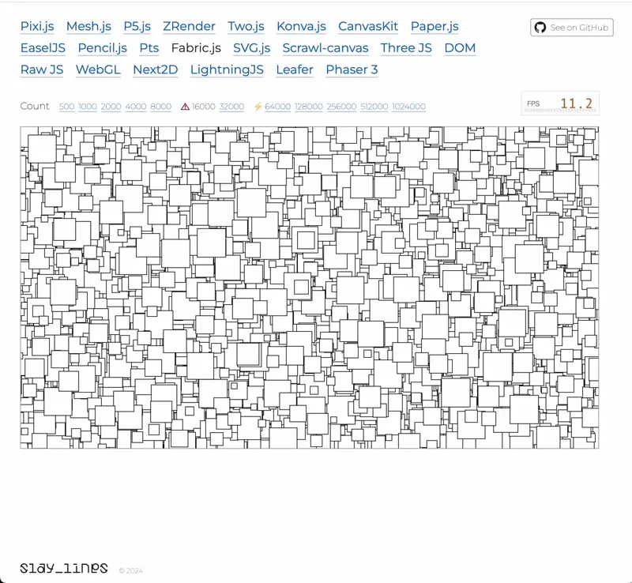

import ZoomableImage from '../../components/ZoomableImage.astro';
export const components = {img: ZoomableImage}

A few weeks ago a colleague of mine and I were looking at the canvas engine comparison benchmarks on [benchmarks.slaylines.io](https://benchmarks.slaylines.io/). The benchmark lists several of the most popular solutions and allows an easy comparison of performance in rendering thousands of rects on a canvas.



At work we both use [fabric.js](https://github.com/fabricjs/fabric.js), which is a canvas engine library focused on interactivity, often at expense of performance. However we had no idea of "how much at expense of performance" it was until we looked at the benchmark which animates 16 000 objects continuously! Despite the premises, in under 2 hours of cracked Teams meeting, we were able to improve the Frame per Second (FPS) rendering from around 13fps to almost 40fps, measured on M2 Pro. That's a 3x or 300% improved performance, in under 2 hours as well!

Most of the changes were not even canvas-specific optimisations, such as we did not change from `CanvasRenderingContext2D` to `WebGLRenderingContext`. So I thought why not using the case to show how we used the Performance tab on Chrome DevTools to measure, investigate and improve the JavaScript execution time of the library. While Chrome has a good documentation on how to get started with [Analysing runtime performance](https://developer.chrome.com/docs/devtools/performance), it's more just an introduction and the [#analyse the results](https://developer.chrome.com/docs/devtools/performance#analyze) section is far from being complete in explaining how to actually find where you can improve, especially in non-trivial cases.
Often you're not committing an evident crime like the [layout thrashing](https://web.dev/articles/avoid-large-complex-layouts-and-layout-thrashing) described in the Google example or it's not just one point that is causing all your performance issues. Whatever the case, this guide will teach you both how to spot low-hanging fruits and less evident issues. 

## An first overview of the Performance results

Let's start by hitting the Record button on the Performance tab of the Chrome Devtools and have a first look at the results. Because we're handling continuous re-rendering in this case, we can just record a few seconds as the execution will repeat periodically. 


There's no doubt that the Performance results are screaming "inefficient!" at us.

### Timeline

The **Timeline** shows what's the browser is busy doing during the recording. Each color represents a different kind of computation, but typically what we look for is the yellow representing JavaScript execution. A typical timeline has some spikes of yellow area, where the browser is most busy running JavaScript and dropping frames:


Occasionally dropping some frames is inevitable and okay if we're building any non-trivial application. On the timeline we look for ranges where there are yellow spikes which last at least half a second. They correspond to moments where many frames where dropped. Screenshots on the bottom of the timeline come very useful to understand what's happening on the page. For instance, in our case we can see that the rectangles are moving:


A long yellow rectangle basically means that it's busy executing JavaScript all the time, without any idle moments. That would not be a problem since we're continuously animating and re-rendering the rects on the canvas, if it were not red line and the multiple red dots on top of the timeline, which indicate frames were dropped because the browser was busy doing JavaScript instead of rendering the page. No surprise the benchmark is showing 12-13fps on the FPS meter! 

FPS should be above at least 24 to be not perceived as laggy. 30fps is a good result, 60fps is great and smooth, 120fps is godly. We want to achieve at least 30fps, which means being able to render 30 times in a second, i.e. `1000 / 30 = 33ms` is the total time we have for everything. That includes executing our own JS to update the rects' on the canvas and browser internal code to re-render the page, notably rendering the canvas on the GPU. So it's actually a bit less than 33ms.

You may think FPS matter only for animations, canvas or games but any web page needs to be re-rendered smoothly actually. Even if you're just moving your mouse around and hovering links or buttons you need the browser to re-render the page and display the hovered button with a different background for instance.
In case you're wondering then _"how do I get an FPS meter if I'm not using a canvas?"_ you can get one from the Chrome Devtools by enabling **FPS Rendering Stats** by clicking on the three dots menu on the top right of the Devtools > More tools > Rendering.


*You can notice that the native Chrome FPS meter is showing a better value than the benchmark built-in FPS meter, 24fps vs 13.6fps. I guess the user-implemented FPS meter is less accurate*

### Summary

The **Summary** is basically telling us how the time is divided in the selected timeline range. In our case, we have selected the range between 2.62s - 3.65s, so roughly 1s, and that time is basically spent entirely running JS (yellow Scripting). The browser is only taking 22ms for itself to do the actual painting.

While the Summary tab does not help with poiting down the performance bottlenecks, it's a good general indicator to get started. And as we go deeper into the analysis it will display really useful information regarding what we select on the flame graph.

### Flame chart

**Flame chart** are a graph visualisation of the call stacks of our functions, at a glance we can see who calls who. Each node on the graph corresponds to a function and traversing the graph with your eyes corresponds to following the code path. I'm a big fan of data visualisation and I think flame graphs are one of the best visualisation tools in general.

In the context of JavaScript and Chrome, the flame graphs show to call stack top-to-bottom, from the caller to the callee. That's why for instance the flame graph area is divided into sections, one graph for each [event loop](https://developer.mozilla.org/en-US/docs/Web/JavaScript/Event_loop) task. In our case, since we're animating, each task is a `requestAnimationFrame` callback because that's the "trigger" that starts our task. In JS, since we have the event loop, the browser is idle unless there's an event that triggers a task, i.e. a mouse event, a Network event, a timeout firing etc.


The Devtools are telling us again that each task is taking too long. We should not use more than 33ms if we want to reach 30fps, but each task is taking 77.63ms and that's on a M2 Pro! Not a surprise that we're dropping frames and the fabric.js benchmark sucks.

Clicking on the "Long task" link on the Summary will takes us to the Chrome documentation where they suggest [splitting the computation into async chunks](https://web.dev/articles/optimize-long-tasks?utm_source=devtools). That's not often possible or it's an advanced optimisation that it's highly application-specific. Definitely not something you can accomplish under two hours! For instance in our case, updating asynchronuously the rects while interleaving frame rendering would result in some rects' positions not being updated or not being rendered. Splitting a computation into async chunks is no easy feat. More often, we need instead to reduce that synchronous computation and leave async chunking as last advanced optimisation.

A nice addition in [Chrome v122](https://developer.chrome.com/blog/new-in-chrome-122#performance-panel-improvements) is that we can even see the initiators of the event tasks, such as who called `setTimeout` or `requestAnimationFrame`. This is very convenient in case you wondering for instance "Why the hell this code is running again".


You can determine the initiator by either following back the arrow in the flame graph or opening the function Source in the Summary tab. I find following the arrow more useful, as the function reference takes to the exact function that called `requestAnimationFrame`, which in our case is just a wrapper:

```ts
import { getFabricWindow } from '../../env';

export function requestAnimFrame(callback: FrameRequestCallback): number {
  return getFabricWindow().requestAnimationFrame(callback);
}

export function cancelAnimFrame(handle: number): void {
  return getFabricWindow().cancelAnimationFrame(handle);
}
```

That won't tell us much about who and why it was called. If you followed instead the arrow in the flame graph you could see the parents in the call stack. It's not a surprise that in our case the initiator it's a function called `animate`, a fabric utility, which in turn is called by a generic _Function call_. That's because we're using an anonymous arrow function, but thankfully the Summary will provide a reference to the function Source:


The function is called `animate` as well, but this time it's the code responsible for updating the rects and asking fabric.js to re-render for each animation frame. Each line of code in the function will have a number label on the left, indicating the total time execution spent on the line for the whole recording.

While bigger values are coloured with a more intense yellow, it's not really indicative that there is something bad about that code. First keep in mind that it's total time, so not per function execution. Unless you see values greater than hundreds of ms for a recording of a few seconds, you should not worry at all. Second, it's natural for some lines of code to take more than other lines and the difference accumulates over the executions, so you often see some lines have much bigger label times. In our case it may seem to suggest that there is a problem with `r.x -= r.speed` but actually there's nothing really wrong with it of course.

So in my experience, evaluate carefully the time labels associated to the lines of code in the Source. They are often misleading you and you risk loosing time following a wrong track. 

*The smartest of you may think "Hey maybe it's actually telling you there is something suspicious with that line of code! Maybe you should make that property write quicker!" Sure, I could probably achieve better time with some low-level optimisations like using some crazy binary operations but that's not really on the top of the list you should try first when analysing performance.*

## Analysing the flame chart

Our goal is to reduce the execution time of each task in the flame chart. A key aspect into doing performance analysis is having first a good grasp of what the code is trying to accomplish. Because only then we can analyse where the performance issues are and think of strategies. Except for cases where a single slow line of code is the cause of the issues, most of the time it will be best to pick a completely different way to accomplish the task at hand.

To do so, we first start by selecting a task and look at the code flow information provided by the graph. 


We can see that each task starts with the "Function Call" which we've seen is the `animate` method of the benchmark. Then we have a few method calls that lead to `_renderObjects`. You'll notice that the nodes in the between and `_renderObjects` itself have basically the same width as the parent node. The width of a node in the flame graph corresponds to the percentage of the parent execution time, so a node that takes all the parent width means that it takes up all the parent total time. That is a very useful information to already have, as it means that we don't care about the parent at all. For instance `renderCanvas` is actually a long method, but because the flame graph is showing us that `_renderObjects` takes all its execution time, we don't need to investigate the other lines of code in the method:


That's why it's important to be proficient at reading the flame graph, it saves lots of time! As you get used to working with the flame graph, you'll naturally skip the nodes/functions whose children nodes take up most of the width. Be careful however not to always jump immediately at the leaf nodes of the flame graph, as you could miss functions that have a significant own execution time, i.e. that spend a good amount of time doing work such as  loops.

Moving on, we can see that `_renderObjects` has several children nodes called `render`, comprising basically the totality of `_renderObjects`' execution time. That's easily explained by looking at its source code:

```ts
_renderObjects(ctx: CanvasRenderingContext2D, objects: FabricObject[]) {
  for (let i = 0, len = objects.length; i < len; ++i) {
    objects[i] && objects[i].render(ctx);
  }
}
```

All it does is basically calling `objects[i].render(ctx)` for each object on the canvas. The flame graph will show us different children nodes called `render`, most of them will have the same width, but some may be wider or more narrow. The number of `render` nodes do not correspond to the actual times they have been executed (16 000 in our benchmark). The function calls are batched and the flame graph is showing us the execution time of each batch, so we should not also think that some single `render` calls take twice than others.

We can thus select any sibling node and look at the juicy `render` function:


The `render` method is responsible for rendering each object, specifically, each rect in our benchmark. Compared to the parent methods, its children nodes are significantly more diverse and there are so many of them that I can't fit all their function names into a single screenshot! Let's have a look at the source code:


If you look at the time labels on the left you'll notice something very weird, that is it seems to suggest that doing an early return is taking `100ms`! I think there's a long standing bug in Chrome where the placement of the time labels are not accurate. I think in this case the time labels are offset by roughly one statement and the 100ms correspond to the `if` block, where the `!this.isOnScreen()` check is potentially expensive. If we go back to the flame chart however, we often don't see any `isOnScreen` node as child of `render`, meaning that it's not actually that significant. And when we do find it under some `render` node, it's just a small node:


We can prove it's not that significant by changing the `render` method to exclude checking for `isOnScreen`, since all our objects are on screen and animated. We save and record Performance again:
- the page FPS meter now reaches 14fps (it was 12fps before)
- each Task in the Flame chart is around 68ms now (it was 78ms before)

That's roughly a ~15% improvement, which is not bad at all but far from what one might have expected from the huge time label number in the Source panel. That's why I don't fully trust the time labels on the Source panel and it's important to master reading the flame graph instead. Of course it's a good improvement and we'll apply it later, but the point is that we were mislead into thinking that `isOnScreen` was the main culprit, whereas as we'll find out later there are more effective targets. Especially with complex codes like canvas or game rendering, focusing your energies into improving the wrong point can be very time consuming. In our case, we could just delete the check knowing our specific case, but typically you would spend hours into thinking and experimenting how to make `isOnScreen` more efficient.

The rest of the time labels are consistent with the flame graph information: there are several function calls that take a bit of code, yeah some take a bit more but none of them is evidently more expensive than the others. We're unlucky! If we had really a big single line taking 50% of the time it would be so easy to spot and improve! Those lines   
can happen, as in the [Google documentation example about layout thrashing](https://developer.chrome.com/docs/devtools/performance#find_the_bottleneck). They are low hanging fruit that should be addressed first if possible. But after low hanging fruits have been picked, you'll find yourself with several fruits which all seem not that juicy.
That's often the case with **hot code paths**, i.e. code paths that get executed the most and determine the overall application performance. Since the `render` function runs for all 16k objects, that means that saving 0.1ms of runtime results in 1600ms / 1.6s of improvement!

### Flame chart patterns

Back to the flame chart of `render`, we typically want to look for these kind of patterns when investigating a flame chart:

1. Single nodes significantly larger than others, indicating that for instance `render` is spending most of its time executing that function node
2. Nodes that repeat very frequently. While each single node doesn't take much time, we can suffer from the famous "death by thousand cuts" if we're running inefficient loops

Based on these patters, a few node catch our eyes:


Occasionally, but frequently enough to be noticeable in the flame chart, a **Minor GC** (Garbage Collection) node appears and it's significantly larger than the other nodes so it satisfies pattern #1. This means that the JavaScript engine deemed necessary to cleanup the memory and that comes at a cost. [Garbage collection](https://developer.mozilla.org/en-US/docs/Web/JavaScript/Memory_management) makes the runtime execution time less predictable as its scheduling is not deterministic. We don't know when it will run and how much it will take, resulting in inconsistent frame rates for instance.

An important and confusing note about the **Minor GC** nodes in the flame chart is that they can mislead you into thinking that the parent node is the responsible for the bad memory management. For a long time I was tricked by it as well. In our screenshot, we'd think that `lineTo` is the culprit but how is that possible since [lineTo](https://developer.mozilla.org/en-US/docs/Web/API/CanvasRenderingContext2D/lineTo) is a native `CanvasRenderingContext2D` method! The truth is that the flame chart will show you **when** something happens, so if the Garbage Collection happens during the execution of `lineTo`, it will appear as its node. The collected memory has been allocated however by a completely different function, which may not even be in the flame chart if it's not that CPU expensive.

Detecting the root cause of the inefficient memory allocations that result in expensive unpredictable Garbage Collection is unfortunately out of the scope of this article. We'll talk more about memory management and analysis in a dedicated future article, but luckily for us the problem will be solved by addressing a CPU-intensive function later. This means that a function in our code is responsible for both inefficient CPU execution and memory management, so solving one problem fixes the other one as well.


Nodes with `save`, `restore`, `fill` and `lineTo` seem to appear very frequently so they satisfy instead pattern #2. It's clear that using them has some cost and we the calls are very frequent, but it's hard to tell if there's any possible action here. They are native `CanvasRenderingContext2D` so we can't inspect them to see the implementation to gather more information about what we could improve. So let's move on for now. 


`calcOwnMatrix` is a node that appears frequently in the flame chart and it takes also a good chunk of the execution time, so it satisifies both flame chart patterns we want to look for. As we'll see it's indeed a very good candidate, but it's once again to hard to tell exactly if there's anything wrong with it. A further is whether there some issue with `calcOwnMatrix` or its children nodes `transformMatrixKey` and `multiplyTransformMatrices` as sometimes they appear as children nodes and as large as `calcOwnMatrix` itself.

So the flame chart analysis has given us some hints on where to look at for further investigation but it would be nice if we can get more direction. What we would like is to have numbers. When working with performance analysis, it's critical to make decisions based on numbers. The Bottom-Up panel will help us with that.

### Bottom-Up analysis

The **Bottom-Up** panel contains all the functions called within the selected timeline range or selected flame graph node. Then we can either sort them by **Self Time** (aggregated own execution time) or **Total time** (aggregated own execution time + internally called functions' execution time). By "aggregated" we mean the sum within the selected Timeline range or Flame chart node. The reason the panel is called Bottom-Up is because we can see the bottom-up call stack of each function if we expand it. This is useful to determine why an expensive function was called:


In order however to analyse the Bottom-Up panel for the `render` function, we have to do something a bit unintuitive: select the `renderCanvas` node in the flame graph instead. The reason is that, as we have noticed, the `render` function nodes in the flame graph are not consistent. They have different width/duration and depending on which specific node you select you'll see different functions and execution times being displayed in the Bottom-Up panel.


While more expensive functions will still show bigger execution time, it's easier to work with bigger aggregated times and more consistent results. You'll notice that with `renderCanvas` we have far more consistent durations and Bottom-Up lists.


Since `render` is a subgraph of the `renderCanvas` flame graph and the former is what's taking almost the whole execution time of the latter, we can expect the expensive `render` functions to be listed. Indeed, let's sort by descending Self Time first and we'll notice that many top results are functions called by `render`:


We have a few potential candidates, like `restore`, `save`, `calcOwnMatrix`, `transformMatrixKey` and `multiplyTransformMatrices`. It's also worth noting that three of these methods involve "matrices". That's because canvas operations, such as rendering, fundamentally require computing the geometric transforms of points and objects, similarly to CSS transforms that can `translate`, `rotate` or `scale`.
For the most curious of you, the mentioned matrix functions are the fabric.js equivalent of the standard JS [DOMMatrix](https://developer.mozilla.org/en-US/docs/Web/API/DOMMatrix) methods. If you want to read a brief explanation of why 2D rendering needs matrix transforms you can read the "Motivation" section of [Dirty Flag optimisation pattern](https://gameprogrammingpatterns.com/dirty-flag.html#motivation) in game development. 
So it would make sense that if we improve the matrix calculations we get also a faster rendering.
About `save` and `restore` instead, which is the [CanvasRenderingContext2D restore](https://developer.mozilla.org/en-US/docs/Web/API/CanvasRenderingContext2D/restore?retiredLocale=it) method, we'll talk in the end of the article, since its optimisation is highly canvas-specific.

However before jumping into investigating matrix transforms, which sounds frightening, let's sort the Bottom-Up list by Total Time as well:


We want to look for function that have a high percentage Total Time but at the same time they are not really up in the flame graph. It means that they take a good chunk of time despite not being a high-level function, i.e. they are expensive lower-level functions.

For instance the `renderCanvas` method has a 100% but that's obvious because it's the function we have selected in the flame graph! The second result with the `(anonymous)` function is misleading as well. It has 100% Total Time because it includes all the anonymous functions, despite the source on the right might tell otherwise. That's why I emphasise the importance of knowing the analysed code, as these results can otherwise mislead you very easily.


The interesting candidates here are : `transform`, `_render`, `calcOwnMatrix`, `_renderPaintInOrder`, `restore`, `transformMatrixKey` and `multiplyTransformMatrices`. A few notes about some of the functions: 
- `drawObject` is excluded because it's called by `render` and actually just delegates object rendering to `_render`, which is also in the list and has similar Total Time, meaning that it's actually `_render` the probable cause of the runtime
  ```ts
  drawObject(ctx: CanvasRenderingContext2D, forClipping?: boolean) {
    this._renderBackground(ctx);
    // ...
    this._render(ctx);
  }
  ```
- `calcTransformMatrix` is excluded similarly because it calls `calcOwnMatrix`, which has a similar Total Time in the list, so there is nothing on `calcTransformMatrix` itself that's interesting:
  ```ts
  calcTransformMatrix(skipGroup = false): TMat2D {
    let matrix = this.calcOwnMatrix();
    // ...
    return matrix;
  }
  ```
- `_render` is included despite calling `_renderPaintInOrder`, which is also in the list, because even though they have a similar Total Time there is enough difference between the two of them to not exclude `_render` immediately:
  ```ts
  _render(ctx: CanvasRenderingContext2D) {
    const { width: w, height: h } = this;
    const x = -w / 2, y = -h / 2;

    ctx.beginPath();

    ctx.moveTo(x + rx, y);

    ctx.lineTo(x + w - rx, y);
    ctx.lineTo(x + w, y + h - ry);
    ctx.lineTo(x + rx, y + h);
    ctx.lineTo(x, y + ry);

    ctx.closePath();

    this._renderPaintInOrder(ctx);
  }
  ```

Both analysis of functions by Self Time and Total Time seem to conclude that we should have a look at the matrix-related functions and `save/restore()`. 

## Improve canvas rendering performance

#### `calcOwnMatrix`

Now that we have our candidates, let's try to dig into them. We'll start from matrix-related functions. We have seen that `calcOwnMatrix` is taking considerable Self Time and Total Time. Let's jump to the Source:


The 215ms time label seem to suggest that there is an expensive line of code, as it's significantly larger than the other labels. It points to `this.ownMatrixCache` but that doesn't make sense since it's just reading a property. It's more plausible that the real line is `transformMatrixKey()`, which if you remember was also listed in the expensive Bottom-Up functions! The function is responsible for getting a cache key to check if the transform matrix needs to be recomputed. At look at `transformMatrixKey` Source implementation seems to confirm this:


Again, the line of code is misleading. By looking at the code, we might think there's some issue with expensive recursive calls of `transformMatrixKey` but actually the faulty line is the return instruction, which creates a long string as cache. Working with a high-level language like JavaScript typically means that we don't have to worry about low-level stuff like String performance, but that doesn't save us from paying the cost of expensive operations if we're not careful. Creating and comparing large strings can get quickly expensive as shown in this [large string comparison benchmark](https://www.measurethat.net/Benchmarks/Show/12809/0/large-string-comparison).

Taking into consideration that we're animating and thus the rects are constantly changing position, using a cache is just useless overhead so we can try removing matrix caching completely. In most cases, you'd probably try to think a more efficient caching key instead, but that's out of the scope of this article.

So let's create our own `OptimisedRect` and override `calcOwnMatrix` to avoid using caching at all. If we reload the page and record Performance again, we'll notice a significant improvement. On My M2 Pro:

- the page FPS meter now reaches 16fps (it was 13fps before)
- each Task in the Flame chart is around 65ms now (it was 77ms before)
- the `calcOwnMatrix` Source is not displaying a Time label with 215ms anymore
  

That's overall a 20% improvement.

<aside>The most knowledgable people reading the article will realise that part of the reason creating large string cache keys was expensive was because of the Garbage Collection as well. Because our rects are animated, the cache keys were recreated continuously and the old keys were garbage collected. Garbage collection takes time to run, especially if large amounds of memory are involved. The flame chart was pointing that out in some occasions! If you go back and look carefully at the flame graphs you'll notice some **Minor GC** (Garbage Collection) nodes.</aside>

#### CanvasRenderingContext2D `save/restore`

Out next candidate based on the Bottom-Up analysis is `ctx.save/restore()`. This is a highly canvas-specific optimisation, but it seems that using saving and restoring the [canvas drawing state](https://developer.mozilla.org/en-US/docs/Web/API/CanvasRenderingContext2D/save#drawing_state) has a non-negligible cost. The cost seem to depend both on the [GPU and 2D Context State](https://stackoverflow.com/questions/38069462/html5-canvas-save-and-restore-performance). Using the Bottom-Up panel we can see who calls `save/restore`:


Let's check the Source of `_renderFill` and `_renderStroke`:


There is nothing particularly noticeable but it's true that `ctx.save/restore` is unnecessary for filling and stroking the rects. We're not using any feature like `strokeUniform` (to render uniform rect borders despite the parent group scale) and fabric.js already calls `ctx.save/restore()` (i.e. pushes a new drawing state) for each `render` call. So doing it before rendering the stroke or fill is futile.

Once again we save and record Performance again:
- the page FPS meter now reaches 20fps (it was 16fps before)
- each Task in the Flame chart is around 50ms now (it was 65ms before)

That's an additional ~25% improvement and we're close to the target of 24fps!.

### `beginPath` vs `fillRect` GPU time

Our next target according to the Bottom-Up list is `_render`, which actually renders the rect using canvas 2D operations:


Rendering a simple rectangle using a combination of 2D Path commands seems unnecessary when you can just do `strokeRect` and `fillRect` and get the same result. Let's try it:

```ts
_render(ctx) {
  ctx.strokeRect(-this.width / 2, -this.height / 2, this.width, this.height);
  ctx.fillStyle = 'white';
  ctx.fillRect(-this.width / 2, -this.height / 2, this.width, this.height);
}
```

Note that we have replaced both the original `_render` implementation but also the `_renderFill` and `_renderStroke` functions, by directing calling `strokeRect` and `fillRect`.

Once again we save and record Performance again:
- the page FPS meter now reaches 28fps (it was 20fps before)
- each Task in the Flame chart is around 32ms now (it was 50ms before)

That's an additional ~40% improvement and we've reached our goal of 24fps!

This may come as a surprise since the Source Time labels did not show significant numbers. However if we compare the GPU times we notice a substantial decrease from 39ms to 23ms. It's hard to tell exactly why the GPU executes `fillRect` instructions faster than `beginPath` instructions. On a wild guess, I'd say it's because a series of direct `fillRect` and `strokeRect` instructions are simpler.


### Matrix transforms

Our updated Bottom-Up list sorted by Total Time now comprises mostly matrix functions, notably `transform`, `calcOwnMatrix`, `multiplyTransformMatrixArray` and `multiplyTransformMatrices`. So far we have avoid digging into these frightening Math functions but it seems it's time to tackle them!


`multiplyTransformMatrixArray` and `multiplyTransformMatrices` are raw matrix calculation functions.

```ts
const multiplyTransformMatrixArray = (
  matrices: (TMat2D | undefined | null | false)[],
  is2x2?: boolean
) =>
  matrices.reduceRight(
    (product: TMat2D, curr) =>
      curr ? multiplyTransformMatrices(curr, product, is2x2) : product,
    iMatrix
  );

const multiplyTransformMatrices = (
  a: TMat2D,
  b: TMat2D,
  is2x2?: boolean
): TMat2D =>
  [
    a[0] * b[0] + a[2] * b[1],
    a[1] * b[0] + a[3] * b[1],
    a[0] * b[2] + a[2] * b[3],
    a[1] * b[2] + a[3] * b[3],
    is2x2 ? 0 : a[0] * b[4] + a[2] * b[5] + a[4],
    is2x2 ? 0 : a[1] * b[4] + a[3] * b[5] + a[5],
  ] as TMat2D;
```

It's hard to improve them further, unless someone knows how to unleash demoniac bitwise operations. Even then, I doubt that a significant change is possible. After all, game development has notorious patterns like [Dirty Flag](https://gameprogrammingpatterns.com/dirty-flag.html) to avoid recomputing matrix transforms because the remain expensive even in C++.

If we look at `transform` instead, we notice that it internally calls `calcOwnMatrix`:

```ts
transform(ctx: CanvasRenderingContext2D) {
  // ...
  const m = this.calcTransformMatrix(true);
  ctx.transform(m[0], m[1], m[2], m[3], m[4], m[5]);
}
```

Even though we have already optimised `calcOwnMatrix` to avoid using cache keys, it still accounts for a good chunk of the Total Time. What we can do is realising that our rects are always just translating, so there is no need to compute the full generic matrix in `calcOwnMatrix`, taking into account scale, rotation etc.

```ts
calcOwnMatrix() {
  const center = this.getRelativeCenterPoint();
  const matrix = fabric.util.createTranslateMatrix(center.x, center.y)
  return matrix;
}
```

Once again we save and record Performance again:
- the page FPS meter now reaches 36fps (it was 28fps before)
- each Task in the Flame chart is around 22ms now (it was 50ms before)

That's once again a ~30% improvement and now the benchmark runs smoothly! Your computer will likely not spin up the fans as well. We've made it!

## Final look at the Performance recording

This was our Performance recording at the beginning of the journey:


This was our Performance recording after the optimisations guided by the analysis:


On the Timeline, we can now see overall yellow area, meaning that we have less JavaScript execution. On top of the Timeline we used to have a full-width red line indicating continuously dropping frames, whereas now frames are dropped only occasionally.

Each Task in the flame chart takes now ~20ms instead of 77ms, so we don't have the red warnings about "Long tasks" as well. Within the same Timeline selected range of 1033ms, we spend now only 789ms for Scripting.

The final benchmark FPS meter shows 36fps, whereas the Chrome Devtools FPS meter even displays 54fps


We're still far from Pixi.js' WebGL rendering performance but we've learnt a lot of Performance analysis using the Chrome Devtools!
